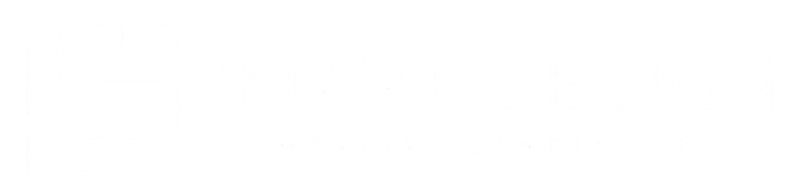
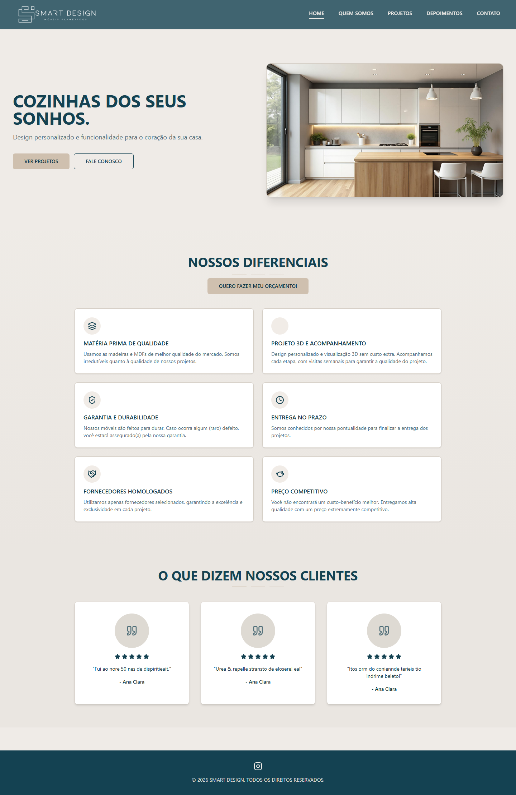
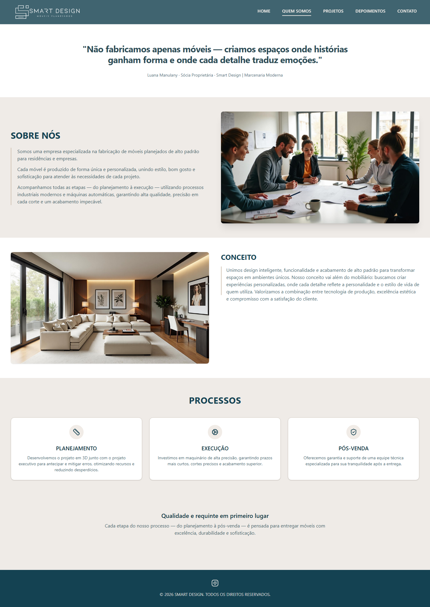
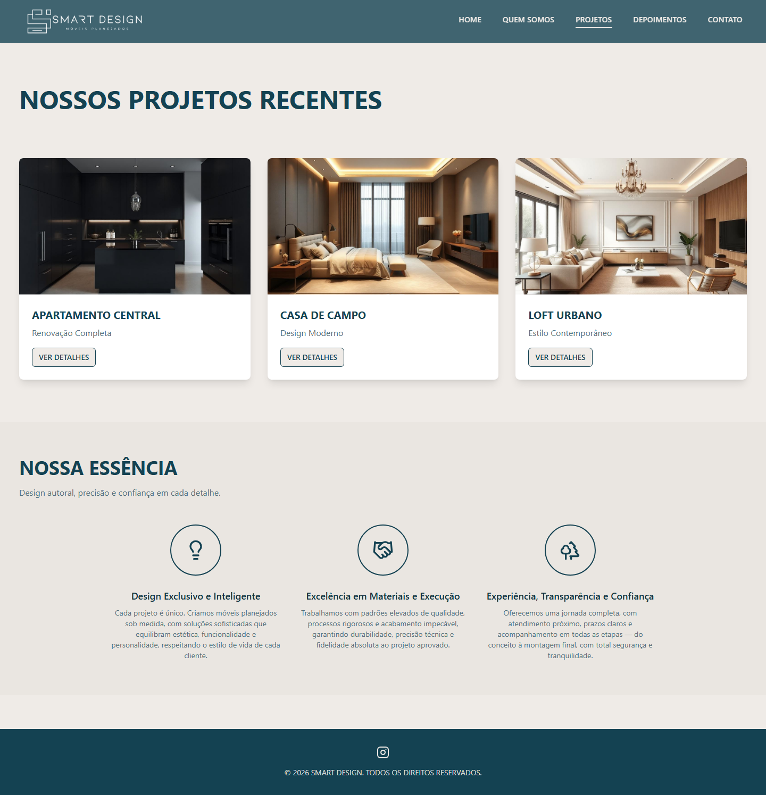
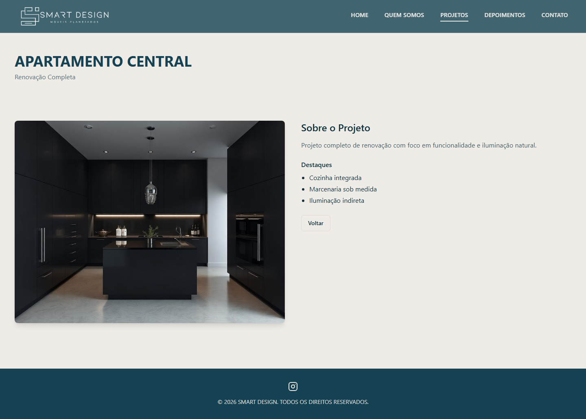
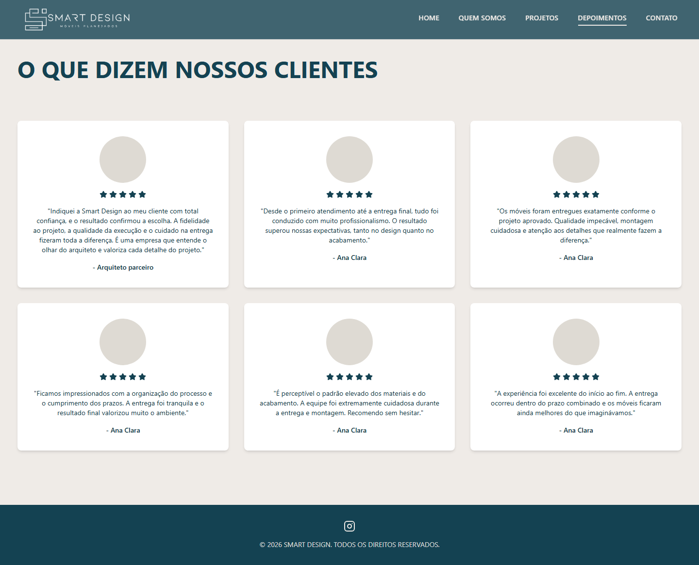
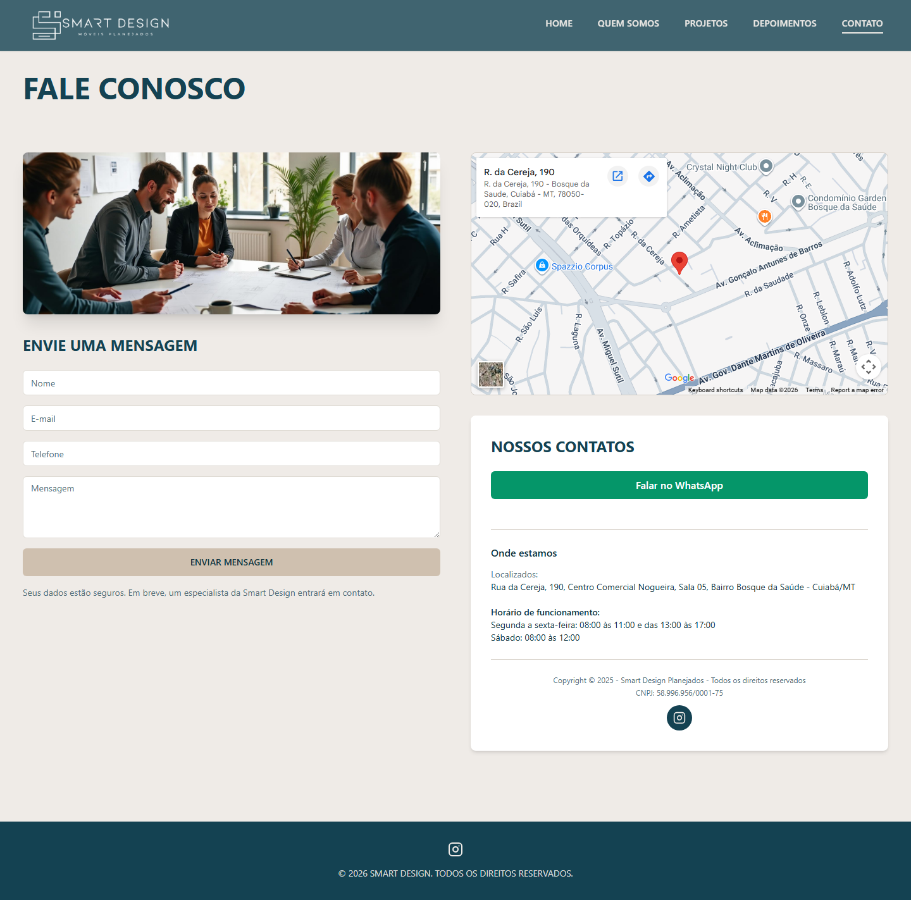

# Smart Design — Site Institucional

<p align="center">
  
</p>

Site institucional da **Smart Design | Marcenaria Moderna**, empresa especializada em móveis planejados de alto padrão para residências e empresas. O projeto apresenta os serviços, portfólio de projetos, depoimentos de clientes e canal de contato integrado ao WhatsApp.

## Sobre o projeto

A Smart Design fabrica móveis sob medida com design personalizado, visualização 3D, acompanhamento em todas as etapas e entrega no prazo. Este site foi desenvolvido para transmitir a identidade da marca, destacar os diferenciais da empresa e facilitar o contato com potenciais clientes.

## Prints do site

### Home

Página inicial com hero, diferenciais da empresa e depoimentos em destaque.



### Quem Somos

História da empresa, conceito, valores e equipe.



### Projetos

Galeria dos projetos recentes com cards clicáveis para ver os detalhes.



### Detalhe do Projeto

Página individual de cada projeto com descrição, características e imagem em destaque.



### Depoimentos

Avaliações e feedback de clientes e parceiros.



### Contato

Formulário de contato com integração ao WhatsApp, mapa e redes sociais.



## Funcionalidades

- Layout responsivo com menu mobile
- Navegação por rotas (React Router)
- Galeria de projetos com páginas de detalhe por slug
- Formulário de contato que redireciona para o WhatsApp
- Botões de orçamento com link direto para o WhatsApp
- Animações suaves em cards, botões e seções
- Navbar com skip-link para acessibilidade
- Tema visual personalizado com tokens HSL (shadcn/ui)

## Stack tecnológica

| Tecnologia | Uso |
|---|---|
| React 18 | Interface e componentes |
| TypeScript | Tipagem estática |
| Vite 5 | Build e servidor de desenvolvimento |
| Tailwind CSS 3 | Estilização utilitária |
| shadcn/ui + Radix UI | Componentes acessíveis |
| React Router v6 | Roteamento SPA |
| TanStack Query | Infraestrutura para dados assíncronos |
| Lucide React | Ícones |

## Como executar

### Pré-requisitos

- [Node.js](https://nodejs.org/) 18 ou superior
- npm

### Instalação

```bash
# Clone o repositório
git clone <url-do-repositorio>
cd Site_Smart_Design

# Instale as dependências
npm install
```

### Desenvolvimento

```bash
npm run dev
```

Acesse [http://localhost:8080](http://localhost:8080) no navegador.

### Build de produção

```bash
npm run build
npm run preview
```

### Lint

```bash
npm run lint
```

## Rotas

| Rota | Página |
|---|---|
| `/` | Home |
| `/quem-somos` | Quem Somos |
| `/projetos` | Lista de Projetos |
| `/projetos/:slug` | Detalhe do Projeto |
| `/depoimentos` | Depoimentos |
| `/contato` | Contato |

## Estrutura do projeto

```
Site_Smart_Design/
├── docs/
│   └── screenshots/          # Prints do site para documentação
├── public/                   # Favicon e arquivos estáticos
├── src/
│   ├── assets/               # Imagens, logo e fotos dos projetos
│   ├── components/           # Navbar, Footer e componentes UI
│   ├── data/
│   │   └── projects.ts       # Base de dados dos projetos
│   ├── hooks/                # Hooks customizados
│   ├── pages/                # Páginas da aplicação
│   ├── App.tsx               # Rotas principais
│   ├── main.tsx              # Ponto de entrada
│   └── index.css             # Variáveis de tema e estilos globais
├── index.html
├── tailwind.config.ts
└── vite.config.ts
```

## Personalização

- **Cores e tema:** edite os tokens HSL em `src/index.css` (seção `:root`)
- **Projetos:** adicione ou edite entradas em `src/data/projects.ts`
- **Logo:** substitua `src/assets/logo.png` (usado no header)
- **Favicon:** substitua `public/favicon.ico` e `public/favicon.png`
- **Contato WhatsApp:** número configurado em `src/pages/Contato.tsx` e `src/pages/Home.tsx`

## Contato

- **WhatsApp:** [(65) 99245-0630](https://wa.me/5565992450630)
- **Instagram:** [@smartdesignplanejados](https://instagram.com/smartdesignplanejados)

## Licença

Projeto privado para uso da Smart Design. Todos os direitos reservados.
